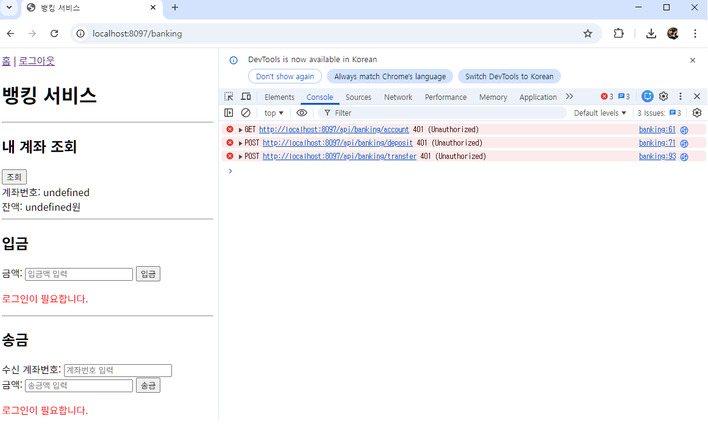
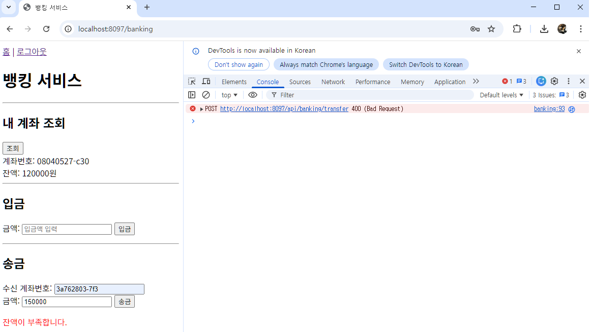
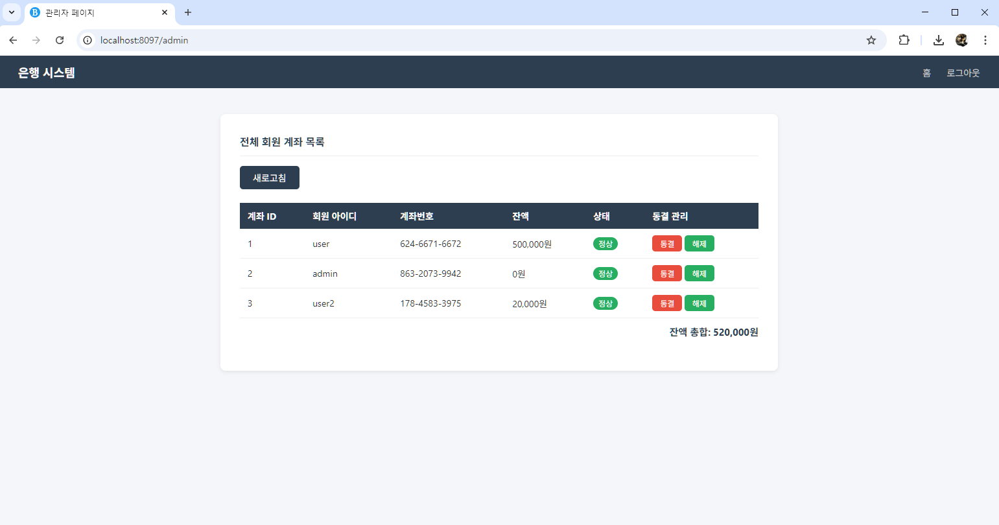

# 은행 시스템 (Bank System)

Spring Boot, Spring Security, JWT를 활용한 권한별 차등 기능을 제공하는 은행 시스템입니다.

---

## 기술 스택

- Java 21
- Spring Boot 4.0.5
- Spring Security
- JWT (jjwt 0.12.6)
- Spring Data JPA
- Oracle DB
- Thymeleaf
- Lombok

---

## 패키지 구조

```
com.example
├── auth          # 사용자 인증 (MemberDetails, MemberDetailsService)
├── config        # Security 설정, 전역 예외 처리
├── controller    # API 컨트롤러 및 페이지 컨트롤러
├── dto
│   ├── request   # 요청 DTO
│   └── response  # 응답 DTO
├── entity        # JPA 엔티티
├── jwt           # JWT 토큰 생성/검증/필터
├── repository    # DB 접근
├── service       # 비즈니스 로직
└── util          # 페이지네이션 유틸 (PageHandler)
```

---

## 데이터 모델

| 테이블 | 주요 필드 |
|---|---|
| Bank_Member | id, username, password, name, role(USER/ADMIN) |
| Bank_Account | id, accountNumber(000-0000-0000), balance, frozen, member_id(FK) |
| Bank_Transaction | id, senderAccount, receiverAccount, amount, type(DEPOSIT/TRANSFER), createdAt |

---

## 권한 체계

| 역할 | 접근 가능 기능 |
|---|---|
| 비회원 | 회원가입, 로그인 |
| USER | 내 계좌 조회, 입금, 송금, 거래 내역 조회 |
| ADMIN | 전체 회원 계좌 목록 조회 (페이지네이션), 전체 잔액 총합, 계좌 동결/해제 |

---

## API 목록

### 인증 (`/api/auth`)
| Method | URL | 설명 | 권한 |
|---|---|---|---|
| POST | /api/auth/register | 회원가입 (계좌 자동 생성) | 없음 |
| POST | /api/auth/login | 로그인 (JWT 발급) | 없음 |

### 뱅킹 (`/api/banking`)
| Method | URL | 설명 | 권한 |
|---|---|---|---|
| GET | /api/banking/account | 내 계좌 조회 | USER |
| POST | /api/banking/deposit | 입금 | USER |
| POST | /api/banking/transfer | 송금 | USER |
| GET | /api/banking/history | 최근 거래 내역 5건 | USER |

### 관리자 (`/api/admin`)
| Method | URL | 설명 | 권한 |
|---|---|---|---|
| GET | /api/admin/members | 전체 회원 목록 | ADMIN |
| GET | /api/admin/accounts?page={n} | 전체 계좌 목록 (페이지네이션, 5건씩) | ADMIN |
| GET | /api/admin/total-balance | 전체 계좌 잔액 총합 | ADMIN |
| POST | /api/admin/account/{id}/freeze | 계좌 동결 | ADMIN |
| POST | /api/admin/account/{id}/unfreeze | 계좌 동결 해제 | ADMIN |

---

## 주요 구현 사항

### JWT 인증 흐름
1. 로그인 시 username, role을 담은 Access Token 발급
2. 이후 모든 요청 시 `Authorization: Bearer {token}` 헤더로 전달
3. `JwtAuthenticationFilter`가 매 요청마다 토큰 검증 후 SecurityContext에 저장
4. 로그인 성공 시 role에 따라 USER → `/banking`, ADMIN → `/admin` 자동 이동

### 송금 트랜잭션
- `@Transactional` 적용으로 출금과 입금을 하나의 트랜잭션으로 처리
- 잔액 부족 시 `RuntimeException` 발생 및 자동 롤백

### 계좌 동결
- 동결된 계좌는 입금, 송금(송신/수신 모두) 불가
- 관리자만 동결/해제 가능

### 계좌번호 형식
- 회원가입 시 자동 생성
- 형식: `000-0000-0000`

### 페이지네이션 (관리자)
- `PageHandler` 유틸 클래스로 페이지 정보 계산
- 한 페이지당 5건, 네비게이션 5페이지씩 표시

---

## 페이지 구성

| URL | 설명 | 접근 |
|---|---|---|
| / | 홈 (로그인 상태에 따라 메뉴 변경) | 전체 |
| /login | 로그인 | 전체 |
| /register | 회원가입 | 전체 |
| /banking | 뱅킹 서비스 | USER |
| /admin | 관리자 페이지 | ADMIN |

---

## 테스트 수행 결과

### 1. 미로그인 상태에서 송금 API 호출 시 401 확인

- 토큰 없이 `POST /api/banking/transfer` 호출 시 `401 Unauthorized` 응답



### 2. 잔액 부족 송금 시 실패 및 잔액 유지 확인

- user1 잔액 부족 상태에서 송금 시도
- "잔액이 부족합니다." 메시지 반환, 잔액 유지
- `@Transactional` + `RuntimeException` 롤백 처리



### 3. ADMIN 계정으로 전체 사용자 계좌 잔액 총합 조회

- ADMIN 로그인 후 관리자 페이지에서 전체 회원 계좌 목록 및 잔액 총합 조회 성공
- 페이지네이션으로 5건씩 표시



---

## DB 초기화 방법

```sql
-- 외래키 순서에 맞게 삭제
DELETE FROM Bank_Transaction;
DELETE FROM Bank_Account;
DELETE FROM Bank_Member;
COMMIT;
```

---

## 실행 방법

```properties
# application.properties
spring.datasource.url=jdbc:oracle:thin:@//localhost:1521/testdb
spring.datasource.username=green
spring.datasource.password=1234
jwt.secret=myJwtSecretKey1234567890AbCdEfGhIjKlMnOpQrStUv
jwt.expiration=3600000
```

서버 실행 후 `http://localhost:8097` 접속